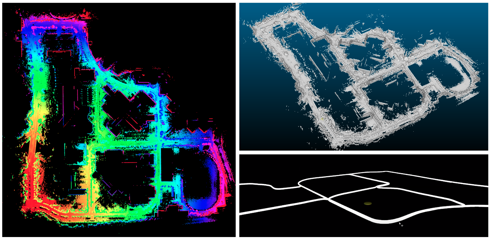
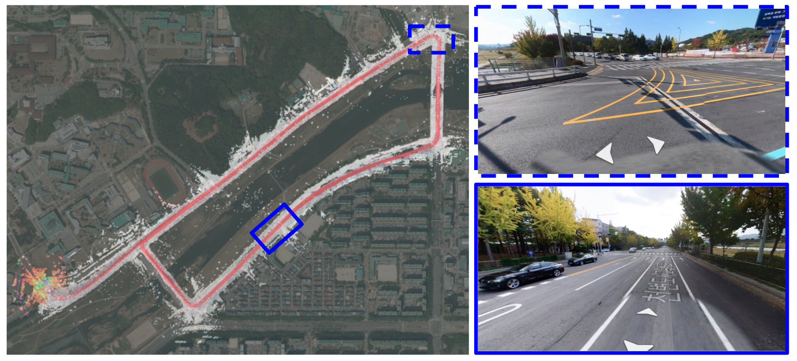
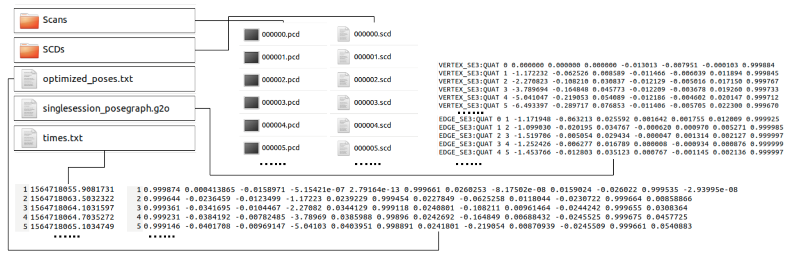
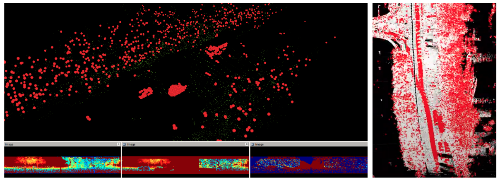
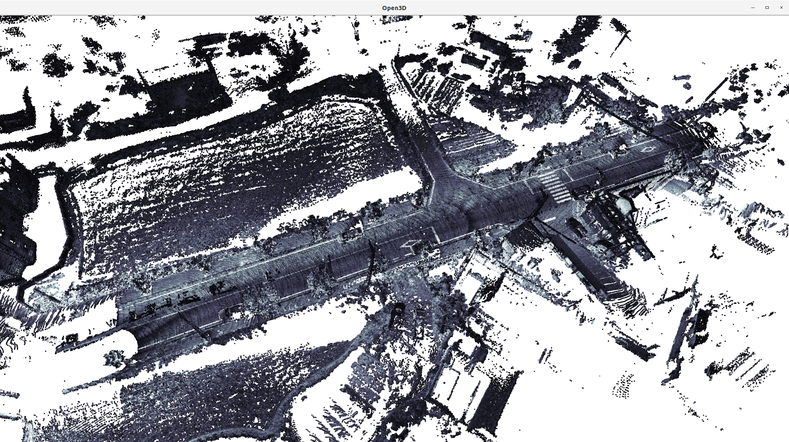

# SC-LIO-SAM
version 2021-06-24 

## What is SC-LIO-SAM?
- SC-LIO-SAM is **a real-time lidar-inertial SLAM package.**
  - LiDAR-inertial SLAM: Scan Context + LIO-SAM
- This repository is an example use-case of [Scan Context](https://github.com/irapkaist/scancontext), which is a fast and robust LiDAR place recognition method.
- For more details for each algorithm please refer to <br>
  Scan Context https://github.com/irapkaist/scancontext <br>
  LIO-SAM https://github.com/TixiaoShan/LIO-SAM <br>
- You can also use the LiDAR-only versions of this project: [SC-LeGO-LOAM](https://github.com/irapkaist/SC-LeGO-LOAM) and [SC-A-LOAM](https://github.com/gisbi-kim/SC-A-LOAM).

## Scan Context: A fast and robust place recognition
- Light-weight: a single header and cpp file named "Scancontext.h" and "Scancontext.cpp"
    - Our module has KDtree and we used <a href="https://github.com/jlblancoc/nanoflann"> nanoflann</a>. nanoflann is an also single-header-program and that file is in our directory.
- Easy to use: A user just remembers and uses only two API functions; ```makeAndSaveScancontextAndKeys``` and ```detectLoopClosureID```.
- Fast: A single loop detection requires under 30 ms (for 20 x 60 size, 3 candidates)


## Examples

We provide example results using [MulRan dataset](https://sites.google.com/view/mulran-pr/dataset), which provides LiDAR and 9dof IMU data. You can see the parameter file (i.e., params_mulran.yaml) modified for MulRan dataset.

#### example 1: [KAIST02 of MulRan dataset](https://youtu.be/Il0YxztuZEU?t=280)

<p align="center"></p>


#### example 2: [Riverside03 of MulRan dataset](https://youtu.be/Y6DXlC34qlc?t=459)
<p align="center"></p>

- As seen in the above [video](https://youtu.be/Y6DXlC34qlc?t=459), the combination of Scan Context loop detector and LIO-SAM's odometry is robust to highly dynamic and less structured environments (e.g., a wide road on a bridge with many moving objects).

## How to use?
- We provide a tutorial that runs SC-LIO-SAM on MulRan dataset, you can reproduce the above results by following these steps. 

1. You can download the dataset at the [MulRan dataset website](https://sites.google.com/view/mulran-pr/home)
2. Place the directory `SC-LIO-SAM` under user catkin work space <br>
 For example, 
    ```
    cd ~/catkin_ws/src
    git clone https://github.com/gisbi-kim/SC-LIO-SAM.git
    cd ..
    catkin_make
    source devel/setup.bash
    roslaunch lio_sam run.launch # or roslaunch lio_sam run_mulran.launch
    ```
3. By following [this guideline](https://github.com/irapkaist/file_player_mulran), you can easily publish the MulRan dataset's LiDAR and IMU topics via ROS.


## Dependency
- All dependencies are same as the original [LIO-SAM](https://github.com/TixiaoShan/LIO-SAM#dependency)


## Notes
#### About performance
- We used two types of loop detetions (i.e., radius search (RS)-based as already implemented in the original LIO-SAM and Scan context (SC)-based global revisit detection). See mapOptmization.cpp for details. ```performSCLoopClosure``` is good for correcting large drifts and ```performRSLoopClosure``` is good for fine-stitching.
- To prevent the wrong map correction, we used Cauchy (but DCS can be used) kernel for loop factor. See mapOptmization.cpp for details. We found that Cauchy is emprically enough.

#### Minor
- We used C++14 to use std::make_unique in Scancontext.cpp but you can use C++11 with slightly modifying only that part.
- We used a larger value for velocity upper bound (see ```failureDetection``` in imuPreintegration.cpp) for fast motions of a MulRan dataset's car platform.
- The some code lines are adapted for Ouster LiDAR. Thus, if you use an other LiDAR, please refer [the original author's guideline](https://github.com/TixiaoShan/LIO-SAM#other-notes) and fix some lines.
- A LiDAR scan of MulRan dataset has no ring information, thus we simply made a hardcoding like ```int rowIdn = (i % 64) + 1 ``` in imageProjection.cpp to make a ring index information that LIO-SAM requires, and it works. However, if you use an other LiDAR, you need to change this line. 

## Applications 
- With our [save utility](https://github.com/gisbi-kim/SC-LIO-SAM/blob/1e1bfea4f7708fbd93d9eb471e63ae9804e1dd16/SC-LIO-SAM/src/mapOptmization.cpp#L203) accompanied with this repository, we can save a set of keyframe's time, estimated pose, a corresponding point cloud, and Scan Context descriptors. The estimated poses are saved as a file named optimized_poses.txt and its format is equivalent to the famous KITTI odometry dataset's pose.txt file. For example: 
<p align="center"></p>

- If you use the above saved files, you can feed these data to [Removert](https://github.com/irapkaist/removert) and can removing dynamic objects. No GT labels or external sensor data such as RTK-GPS is required. This [tutorial](https://youtu.be/UiYYrPMcIRU) guides steps from running SC-LIO-SAM to save data to Removert to remove dynamic objects in a scan. Example results are: 
<p align="center"></p>

- For the safe and light-weight map saver, we support off-line scan merging utils for the global map construction within user's ROI (see tools/python/makeMergedMap.py, for the details, see the [tutorial video](https://youtu.be/jmR3DH_A4Co)) 
  <p align="center"></p>

## Cite SC-LIO-SAM 

```
@INPROCEEDINGS { gkim-2018-iros,
  author = {Kim, Giseop and Kim, Ayoung},
  title = { Scan Context: Egocentric Spatial Descriptor for Place Recognition within {3D} Point Cloud Map },
  booktitle = { Proceedings of the IEEE/RSJ International Conference on Intelligent Robots and Systems },
  year = { 2018 },
  month = { Oct. },
  address = { Madrid }
}
```
 and 
```
@inproceedings{liosam2020shan,
  title={LIO-SAM: Tightly-coupled Lidar Inertial Odometry via Smoothing and Mapping},
  author={Shan, Tixiao and Englot, Brendan and Meyers, Drew and Wang, Wei and Ratti, Carlo and Rus Daniela},
  booktitle={IEEE/RSJ International Conference on Intelligent Robots and Systems (IROS)},
  pages={5135-5142},
  year={2020},
  organization={IEEE}
}
```

## Contact
- Maintainer: Giseop Kim (`paulgkim@kaist.ac.kr`)
#### Contributors
- Minwoo Jung: made the original LIO-SAM runs on the MulRan dataset. 

## Acknowledgement
  - SC-LIO-SAM is based on LIO-SAM (Tixiao Shan et al., IROS 2020). We thank Tixiao Shan and the LIO-SAM authors for providing a great base framework.

## Update history 
- 2021.06.23
  - yaml file is reformatted to support the compatible form with the recent original LIO-SAM repository.  
  - offline ROI global map construction python util is supported. 

## TODO
- About performance
  - improve better RS loop closing (ICP test sometimes fails in reverse directions) 
  - support reverse-closing of SC loops with Scan Context initial yaw
  - support SC augmentation 
  - lagged RS loop closing after large drifts solved 
- About funtions for convenience
  - [x] save extended data: nodes' time, 6D pose, node's point cloud, and corresponding SC descriptors
  - [x] make a static map and self-labeled dynamic points by combining SC-LIO-SAM and [removert](https://github.com/irapkaist/removert). 
- Minor (not related to the performance)
  - fix the visualization issue: disappearing map points after SC loop closing
  - fix safe-save for map points after closing the program   
